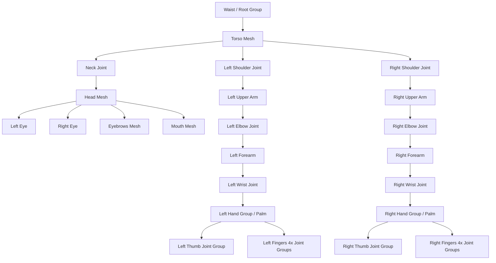

# ASL Animator Skill

This skill guides the agent in creating high-quality, interactive, and visually stunning 3D ASL (American Sign Language) animations. It replaces low-quality, procedural cylinder models with a complete articulated humanoid avatar, keyframe transitions, fingerspelling parser, and an educational playback dashboard.

## When to Use This Skill

Use this skill when the user requests:
- A new interactive 3D ASL sign visualization (e.g., in a chapter, a glossary term, or standalone).
- Enhancing or replacing the old hand-viewer prototype with high-quality character animations.
- Creating conversational or grammatical ASL phrase visualizers.
- Interactive tools showing fingerspelling or sign parameters.

---

## 3D Avatar Architecture & Rigging

To ensure the simulation is premium, lightweight, and completely self-contained, the avatar must be built procedurally in Three.js using clean geometries (spheres, cylinders, and capsules) arranged in a hierarchical rig. Do not import heavy external GLTF assets unless explicitly requested.

### Joint Rig Hierarchy

The avatar should represent the upper body (waist-up), focusing on the torso, head, arms, and detailed fingers:



### Proportions & Sizing

Use realistic human proportions relative to the torso size:
- **Torso Height**: 1.8 units, Width: 1.4 units, Depth: 0.6 units
- **Head Radius**: 0.45 units, positioned 1.1 units above torso center
- **Upper Arm Length**: 0.9 units, Radius: 0.12 units
- **Forearm Length**: 0.8 units, Radius: 0.10 units
- **Hand Palm**: Width: 0.35 units, Height: 0.4 units, Depth: 0.08 units
- **Fingers**: 4 fingers and 1 thumb. Each finger consists of 3 segments (proximal, middle, distal) with sizes scaled matching the finger role (index vs pinky).

---

## The Pose & Animation System

ASL signs are composed of five core parameters: **Handshape**, **Orientation**, **Location**, **Movement**, and **Non-Manual Signals (NMS)**. The animation system must support specifying these parameters in a keyframe format.

### Keyframe JSON Specification

An ASL gesture sequence consists of an array of keyframes. Each keyframe represents a target skeletal pose and NMS state to transition to:

```json
{
  "duration": 400, 
  "expressions": {
    "eyebrows": "raised", 
    "mouth": "o-shape"
  },
  "leftArm": {
    "shoulder": [0.2, 0.0, -0.4],
    "elbow": [1.1, 0.0, 0.0],
    "wrist": [0.0, 0.3, 0.0]
  },
  "leftHand": {
    "pose": "asl-a",
    "customCurl": null
  },
  "rightArm": {
    "shoulder": [-0.5, 0.0, 0.6],
    "elbow": [1.5, 0.0, 0.0],
    "wrist": [0.1, 0.0, -0.2]
  },
  "rightHand": {
    "pose": "open",
    "customCurl": {
      "thumb": 0, "index": 0, "middle": 0, "ring": 0, "pinky": 0
    }
  }
}
```

### Transition Interpolation (Slerp & Lerp)

Animations must be smooth. At each frame in the rendering loop:
1. Track the current animation time and the current active keyframe.
2. Calculate the progress fraction `t = elapsed / duration` (with easing, e.g., quadratic in-out: `t < 0.5 ? 2 * t * t : 1 - Math.pow(-2 * t + 2, 2) / 2`).
3. For joint rotations, interpolate from the starting keyframe quaternion to the target keyframe quaternion using **Spherical Linear Interpolation (SLERP)**:
   ```javascript
   currentQuaternion.slerpQuaternions(startQuaternion, targetQuaternion, t);
   ```
4. For finger curls and facial features, interpolate values using **Linear Interpolation (LERP)**.

---

## High-Quality Features & Educational Tools

### 1. Motion Path Tracing (Movement Visualizer)
A critical feature for learning ASL is visualizing the spatial movement path of the hands. 
- Maintain a circular buffer of the wrist/fingertip positions over the last 60 frames.
- Draw these positions as a glowing 3D ribbon or line strip in the scene:
  ```javascript
  const pathGeometry = new THREE.BufferGeometry().setFromPoints(pointHistory);
  const pathMaterial = new THREE.LineBasicMaterial({ color: 0x667eea, linewidth: 2, transparent: true, opacity: 0.7 });
  const pathLine = new THREE.Line(pathGeometry, pathMaterial);
  ```
- Fade the opacity of the line segments based on age (earlier positions are more transparent).
- Add a toggle in the UI to turn path tracing on/off.

### 2. Non-Manual Signals (NMS) Rendering
Facial expressions convey grammar in ASL (e.g. raised eyebrows for yes/no questions, furrowed for wh-questions, mouth morphemes for adverbs).
- Represent eyebrows using thin curved shapes that can move up/down or tilt.
- Represent the mouth as an shape-morphable loop or scale-adjustable geometry to represent neutral, "o-shape", smile, or open mouth.
- Provide presets in the pose dictionary for standard NMS states (`neutral`, `raised-eyebrows`, `furrowed-eyebrows`, `mouth-o`, `mouth-cha`).

### 3. Smart Text-to-Sign Parser
The simulator must contain a parsing input where a user types natural text (e.g. "HELLO I LOVE YOU"):
- Split input into words/tokens.
- Match tokens against a preloaded vocabulary dictionary (e.g. `HELLO`, `I-LOVE-YOU`, `THANK-YOU`).
- If a token is found, schedule its keyframe sequence.
- If a token is NOT found (unrecognized word), fingerspell the word by queuing the pose frames for each letter from A to Z with a short transit duration (e.g., 250ms per letter) and a slight pause (e.g., 100ms) between letters.
- Insert a hand-drop/neutral transit pose (400ms) between words.

---

## Modern User Interface Layout

The interface must be designed to feel premium, featuring a responsive, clean, dark-mode dashboard with subtle micro-animations.

### Visual Components:
- **Left Panel (3D Canvas)**: WebGL renderer viewport. Overlay transparent buttons for:
  - **Camera Presets**: `Front` (default), `Side` (profile), `Close-up (Hands)`, `Close-up (Face)`, `Orbit` (free rotate).
  - **Overlays**: Toggle `Skeleton Bones` (shows joint joints/axes), Toggle `Motion Paths` (paths trails).
- **Right Panel (Dashboard Controls)**:
  - **Playback Panel**: Play/Pause button, timeline slider/scrubber showing current word progress, speed factor buttons (`0.5x`, `1.0x`, `1.5x`, `2.0x`).
  - **Signing Input**: A text box where users can type a sentence and hit "Sign".
  - **Glossary Index**: Grid of pre-baked signs that can be clicked to play immediately.
  - **Mirror Mode**: Toggle switch to flip the character horizontal scale (x-axis scaled by -1) to simulate signing from a mirror perspective.

---

## Step-by-Step Implementation Workflow

When generating a new ASL animation simulation, follow these steps:

### Step 1: Scaffold the Directory
Create the directory `docs/sims/asl-<name>/` containing:
- `index.md`: Standard textbook integration page with lesson plans, markdown content, and an iframe embedding `main.html`.
- `metadata.json`: Educational taxonomy and standard Dublin Core fields.
- `main.html`: Structured interface layout importing Tailwind CSS, Three.js, and OrbitControls.
- `<name>.js`: The core implementation containing the avatar rig, sign definitions, interpolation math, and UI event binding.
- `local.css`: Custom layout rules, dark theme styles, and glassmorphism.

### Step 2: Establish the Rig
In the `.js` file, construct the upper body skeleton using hierarchical groups. Attach appropriate material colors:
- Skin color: `#ffdbac` (or adjustable tone).
- Torso color: Sleek slate or navy color `#2d3748` to look like a shirt, which creates a strong contrast for the hands! (This is critical: light skin-toned hands are very hard to see against a skin-toned torso. Use a dark shirt color to maximize readability).

### Step 3: Implement the Sign Dictionary
Define a JSON structure in the script containing key poses. At a minimum, include:
- The fingerspelling alphabet (`a`, `b`, `c`, ..., `z`).
- Core vocabulary matching the chapter topic.
- A neutral "home" pose where arms are resting or positioned in front comfortably.

### Step 4: Add Animation Loop
In the Three.js `requestAnimationFrame` loop:
- Process the queue of active pose targets.
- Apply LERP/SLERP interpolation math to update joint rotations based on elapsed time.
- Update the path-tracing line geometry with the new hand joint coordinates.
- Call `renderer.render(scene, camera)`.

### Step 5: Test and Validate
- Verify with `validate-sims.py --sim asl-<name>`.
- Fix iframe heights with `fix-iframe-heights.py --sim asl-<name>`.
- Capture screenshot using `bk-capture-screenshot /path/to/sim 3 700`.
- Perform the layout review and visual checklist checks.
