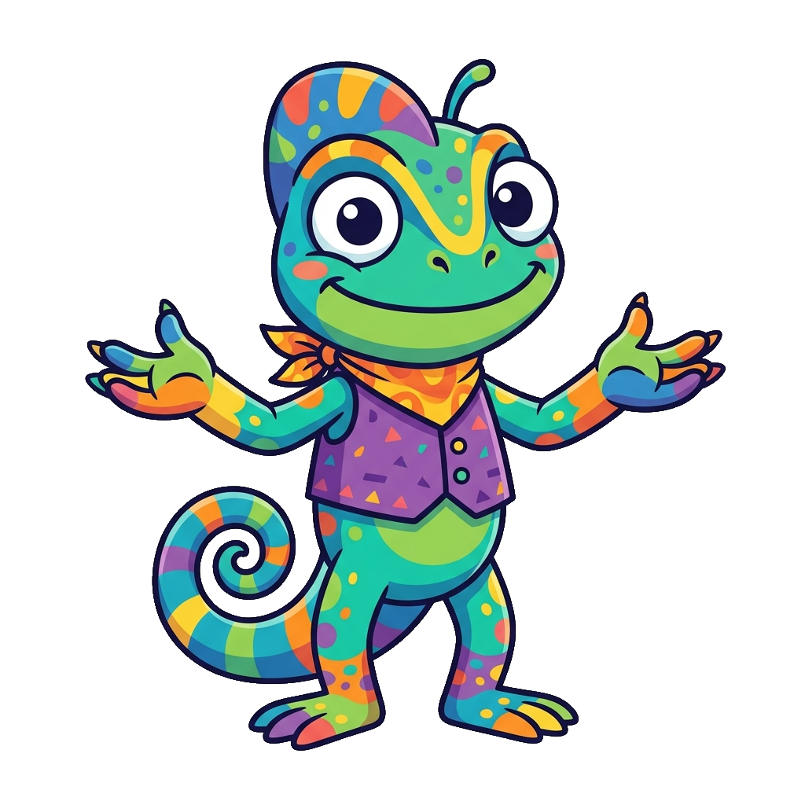

# Pronouns and Signing Space

## Summary

Explores how to use personal pronouns, indexing, directionality, and the physical signing space to structure communication. After completing this chapter, students will be able to recognize, understand, and apply these concepts in visual communication contexts.

## Concepts Covered

This chapter covers the following 15 concepts from the learning graph:

* I
* You
* He/She
* We
* They
* This
* That
* Here
* There
* Signing Space
* Directionality
* Indexing
* Topicalization
* Negation
* Question Formation

## Prerequisites

This chapter builds on concepts from:

* [Chapter 1: Introduction and ASL Foundations](../01-intro-asl-foundations/index.md)
* [Chapter 2: Fingerspelling and Numbers](../02-fingerspelling-numbers/index.md)
* [Chapter 3: Basic Conversational Phrases](../03-basic-conversation/index.md)

---

!!! mascot-welcome "Welcome to Chapter 4!"
    { class="mascot-admonition-img" }
    Hi there! Mimi here, ready to explore. In this chapter, we are going to dive into **Pronouns and Signing Space**! We'll learn how to express these concepts clearly and practice them in signing space. Let's make some signs!

## 1. Establishing Space: The Football Game

In the middle of a bustling family reunion, Liam and his uncle David stood next to the picnic tables, deep in an ASL conversation. David was describing a legendary high school football game from his youth. Instead of using words to describe the positions, David used the physical space in front of him as a mini-football field.

First, David pointed his index finger to his left side, establishing a spot in the air. "The quarterback was here," he signed. Then, he pointed to his right side. "The receiver was here." 

With the spatial map established, David signed: `HE` (pointing left) `THROW` `HE` (pointing right). 

David didn't need to repeat the words "quarterback" or "receiver." By pointing to the specific spatial coordinates he had designated, his hand indexing carried all the grammatical relationships. When the play was over, David swept his hand across the space to clear the imaginary field, ready to set up his next spatial map. This visual-spatial indexing is the heart of ASL grammar.

---

## 2. Personal and Possessive Pronouns

ASL maps pronouns directly onto the signing space using contrastive handshapes.

### Personal Pronouns (Pointing finger)
To sign *I/Me*, *You*, *He/She/It*, *We*, or *They*, use an **index finger "1" handshape**:
* **I/Me**: Point directly to your chest.
* **You**: Point forward to the receiver.
* **He/She/It**: Point to a specific coordinate on your left or right.

### Possessive Pronouns (Flat hand)
To sign *My/Mine*, *Your/Yours*, or *His/Hers/Its*, use a **flat open "B" handshape**:
* **My/Mine**: Press flat palm to your chest.
* **Your/Yours**: Push flat palm forward.

#### Diagram: Personal vs Possessive Handshapes

A 3D comparison showing 'You' (pointing index) vs 'Your' (flat palm) showing how changing the handshape changes grammatical pronoun cases.

??? question "Check Your Understanding - Click to Expand"
    **Question 1**: How do you establish an absent person (e.g., 'my sister') in ASL signing space?
    
    *Answer*: First sign the noun (`MY SISTER`), then point (index) to a specific unoccupied space on your left or right. For the rest of the conversation, pointing back to that exact spot refers to her.
    
    **Question 2**: What handshape is used for possessive pronouns?
    
    *Answer*: A flat, open "B" handshape (palm facing the person or area associated with the possessor).

---

## 3. Spatial Reference and Directional Verbs

Some verbs change their movement path to indicate the subject and object. This is called **Directionality** (Agreement Verbs).

* **HELP**: Moving the sign from you to the receiver means "I help you." Moving the sign from the receiver to you means "You help me."
* **GIVE**: Moving from left to right means "He gives to him."

#### Diagram: Directional Signs

A 3D motion comparison showing the verb sign 'HELP' transitioning from 'I help you' to 'You help me'.

Before we explore the spatial indexing maps, let's look at how ASL sets up these reference points.

#### Diagram: Pronoun Indexing Map
<iframe src="../../sims/pronoun-indexing-map/main.html" width="100%" height="500px" scrolling="no"></iframe>

Pronoun Indexing Map

Type: infographic
**sim-id:** pronoun-indexing-map 
**Library:** p5.js 
**Status:** Specified
Learning objective: Map spatial pronouns (left, right, center) to coordinate zones in signing space.
- Left: Top-down map of signing space with hot zones: Left, Center, Right.
- Right: Description card showing pronoun text and palm orientation parameters.

---

## Summary and Key Takeaways

### Key Takeaways
* **Spatial Concepts**: Always verify your physical anchors and boundary limits inside the signing space.
* **Visual Expression**: Face movements and body posture are key parts of the sign structure.
* **Practice Rules**: Keep practicing in front of a mirror or with partners to build finger coordination and spatial memory.

!!! mascot-encourage "Keep Up the Good Work!"
    { class="mascot-admonition-img" }
    Learning new parameters and coordinates takes time, but your muscle memory is building every day. You're doing amazing!

As you prepare to move on, take a moment to reflect on what your hands can now do. You are not just learning a code—you are opening a door to a vibrant community, a rich history, and a brand-new way of looking at human communication. 

In the next chapter, we will build directly on these foundations. Get ready to see how these signs map onto your hands!

!!! mascot-celebration "Congratulations!"
    { class="mascot-admonition-img" }
    You've completed Chapter 4! I'm so proud of your hard work. Let's keep the signing going in the next chapter!
