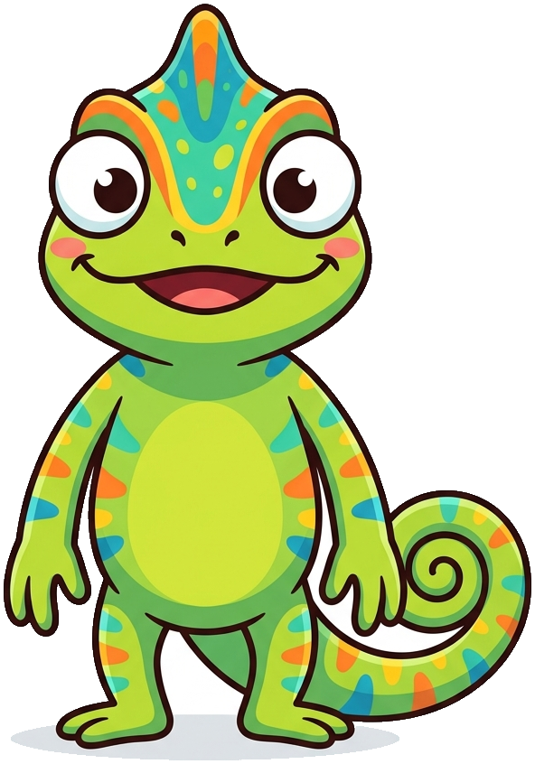
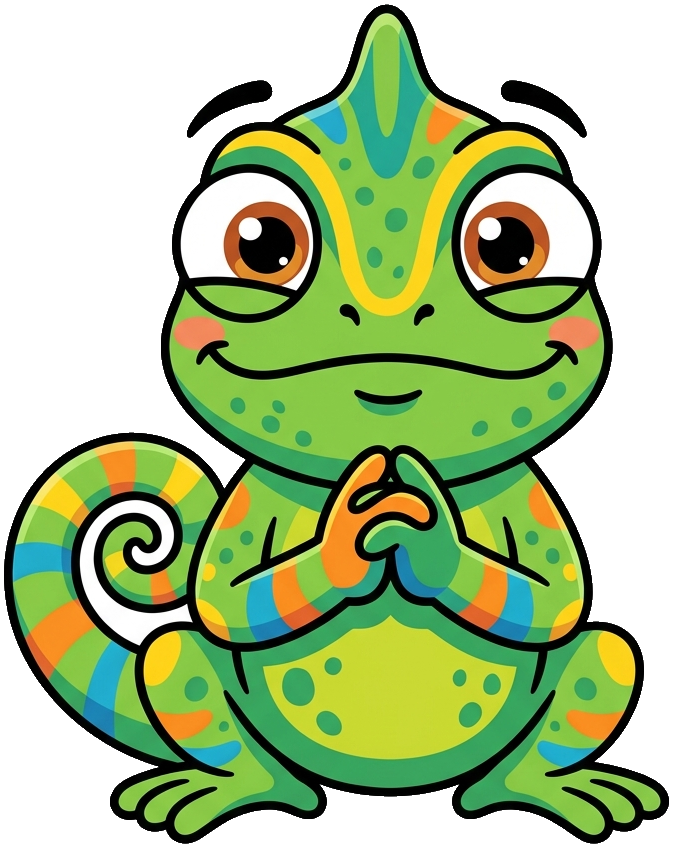
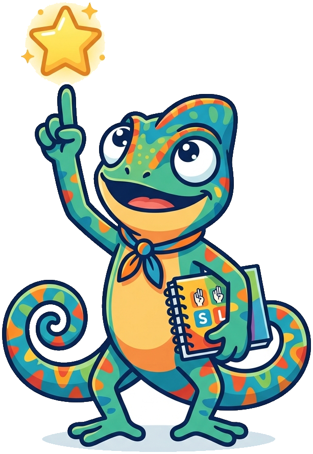
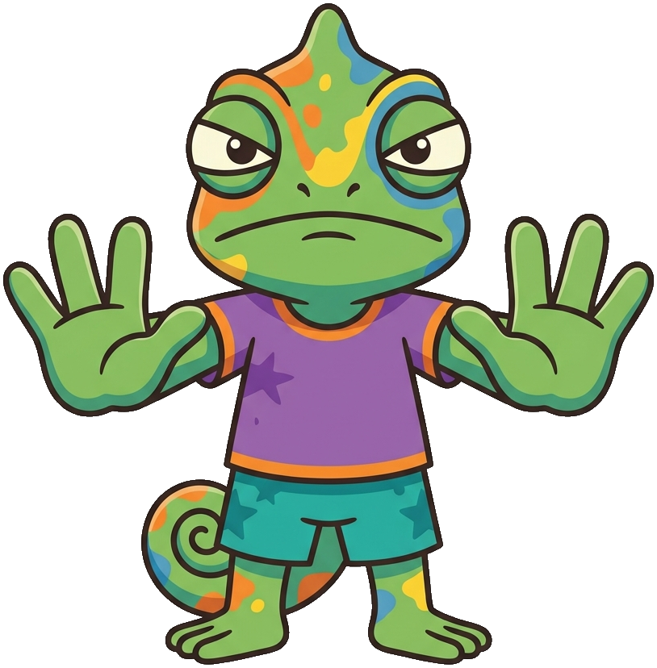

# Mascot Integration Test Page

This page is a test to verify that the mascot images for **Mimi the Chameleon** are loaded correctly, have valid paths, and render properly in the textbook.

Below are the seven standard poses of Mimi the Chameleon.

## Poses and Paths

| Pose | Image | Relative Path | Size | Status |
| :--- | :---: | :--- | :--- | :--- |
| **1. Neutral** | { width=80 } | `docs/img/mascot/neutral.png` | ~500x500 | Active |
| **2. Welcome** | { width=80 } | `docs/img/mascot/welcome.png` | ~500x500 | Active |
| **3. Thinking** | { width=80 } | `docs/img/mascot/thinking.png` | ~500x500 | Active |
| **4. Tip** | { width=80 } | `docs/img/mascot/tip.png` | ~500x500 | Active |
| **5. Warning** | { width=80 } | `docs/img/mascot/warning.png` | ~500x500 | Active |
| **6. Encouragement** | { width=80 } | `docs/img/mascot/encouragement.png` | ~500x500 | Active |
| **7. Celebration** | { width=80 } | `docs/img/mascot/celebration.png` | ~500x500 | Active |

## Rendering Test (Custom Callouts)

Here are examples of how Mimi will appear inside textbook custom boxes:

!!! tip "Tip from Mimi"
    { align=left width=60 }
    **Remember:** Facial expressions are not just extra emotion in ASL—they are a grammatical requirement! Raising your eyebrows marks a yes/no question.

 

!!! warning "Common Pitfall"
    { align=left width=60 }
    **Watch Out:** Don't bounce your hand when fingerspelling double letters like 'EE' or 'OO'. Instead, slide your hand slightly to the side or double-tap the letter.

 
